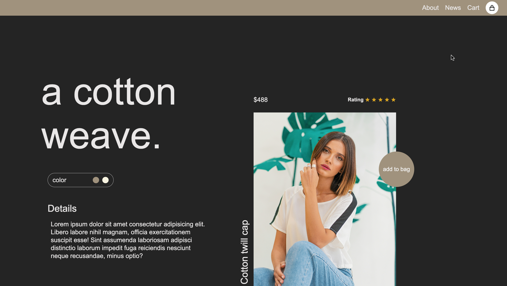

# CSS Project 2


## Description

This project involves developing a responsive and user-friendly interface using HTML and CSS. The goal is to create a dynamic web experience with consistent cross-browser compatibility. Key features include a clean design, intuitive navigation, and adaptive layouts that enhance user interaction across various devices.

## Features

- **Responsive Design**: Adapts seamlessly to various screen sizes and devices.
- **Cross-Browser Compatibility**: Ensures consistent performance across different web browsers.
- **Clean and Intuitive UI**: Focuses on user experience with a simple and elegant interface.
- **Dynamic Content Rendering**: Utilizes CSS for dynamic and engaging content presentation.

## Workflow

The development process follows a structured workflow:
1. **Planning**: Outline the project scope, goals, and design.
2. **Implementation**: Develop the HTML and CSS code.
3. **Testing**: Ensure functionality and compatibility across devices and browsers.
4. **Deployment**: Launch the project and make it accessible to users.

## Contribution Guidelines

We welcome contributions! Please follow these guidelines:
1. **Fork the Repository**: Create a personal copy of the project.
2. **Create a Branch**: Use a descriptive name for your branch (e.g., `feature/new-layout`).
3. **Commit Changes**: Write clear, concise commit messages.
4. **Open a Pull Request**: Describe your changes and submit your pull request.

## Getting Started

To get a local copy up and running, follow these steps:

1. **Clone the Repository**:
    ```bash
    git clone https://github.com/kaakanksha2310/CSS-Project-2.git
    ```

2. **Open the Project**:
    ```bash
    cd CSS-Project-2
    ```

3. **Open in Visual Studio Code**:
    ```bash
    code .
    ```

## License

This project is licensed under the MIT License.

## Contact

For questions or feedback, please reach out to the repository owner.

---

Thank you for visiting and contributing to this project!
